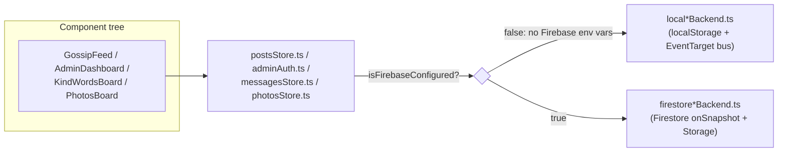
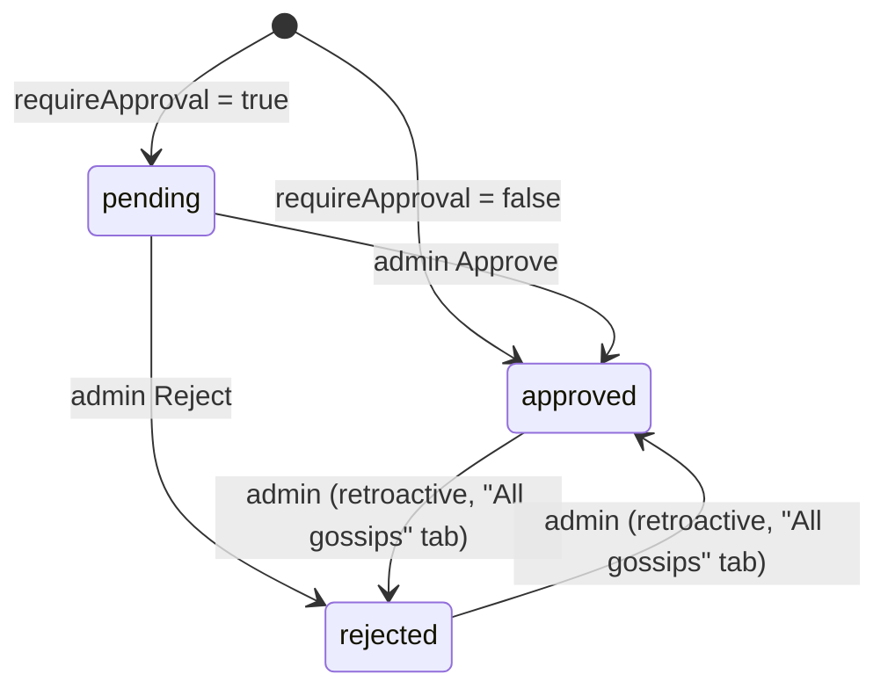

# Architecture

Technical reference for how GossipBox is put together. For day-to-day
conventions and "how do I add X" guidance, see [CLAUDE.md](CLAUDE.md); for
the feature/setup writeup aimed at a human running the app, see
[README.md](README.md). This document is the deeper "why is it built this
way" reference the other two intentionally don't try to be.

## Stack

- **Next.js 16 (App Router) + TypeScript + Tailwind v4**, deployed to
  Vercel. `npm run dev` runs Turbopack by default (see `AGENTS.md` for the
  reminder that this Next.js version may differ from training data).
- **Firebase** — Firestore (documents), Storage (images), Authentication
  (admin accounts) — used only when configured.
- **No backend of its own.** There is no API route layer; every page is a
  client component (`"use client"`) that talks directly to either
  `localStorage` or the Firebase SDK from the browser. `firestore.rules` /
  `storage.rules` are the only server-side logic in the project.

## The dual-backend pattern

The single most important structural decision in this codebase: **every
domain can run against Firebase or against `localStorage` in the same
browser, chosen automatically at runtime with zero config**, so the
prototype is clickable immediately and the exact same UI code later
becomes the production app once a Firebase project is wired up.



`src/lib/firebase.ts` exports `isFirebaseConfigured`, `true` only when
`NEXT_PUBLIC_FIREBASE_API_KEY` and `NEXT_PUBLIC_FIREBASE_PROJECT_ID` are
both set (see `.env.local.example`). Every *-Store.ts module is a thin
dispatcher on that flag — **components only ever import from a `*Store.ts`
file, never from a `local*Backend.ts` or `firestore*Backend.ts` file
directly.**

| Domain | Store (dispatcher) | Local backend | Firestore backend |
|---|---|---|---|
| Gossip posts + moderation + admin session | `postsStore.ts` / `adminAuth.ts` | `localBackend.ts` | `firestoreBackend.ts` |
| Kind Words messages | `messagesStore.ts` | `localMessagesBackend.ts` | `firestoreMessagesBackend.ts` |
| Photos & Personal Info entries | `photosStore.ts` | `localPhotosBackend.ts` | `firestorePhotosBackend.ts` |

These three domains are **deliberately not merged** into shared files even
though the pattern is identical — they're unrelated data (no moderation or
reactions on messages/photo entries) that happen to share a *shape*, not a
*relationship*. Any future fourth board should follow the same
sibling-files approach rather than growing one of the existing stores.

### Local backend mechanics

Each `local*Backend.ts` keeps its collection in one `localStorage` key
(`gossipbox_posts`, `gossipbox_messages`, `gossipbox_photo_entries`,
`gossipbox_settings`, `gossipbox_admin_local`) and uses a module-level
`EventTarget` as an in-tab pub/sub bus: any write dispatches a `"change"`
event that every `subscribe*` listener re-reads state on. A `window`
`"storage"` event listener additionally re-syncs when *another tab*
changes the same key, so multiple tabs/components stay consistent without
a real backend. There is no server — all validation, ID generation
(`uuid`), and sorting happens client-side.

### Firestore backend mechanics

Each `firestore*Backend.ts` uses `onSnapshot` for live queries (no manual
polling/refetching) and uploads images to Storage via `uploadString(...,
"data_url")` before writing the Firestore document, storing the resulting
download URL as a plain string field. `firestore.rules` is the *actual*
enforcement boundary in this mode — the client-side checks (e.g. compose
button `disabled` state) are UX only. See "Security model" below.

### Switching modes

Nothing to configure beyond environment variables:

- **Local demo mode** — no `NEXT_PUBLIC_FIREBASE_*` vars set (or emptied).
  Data lives only in that browser (no UI indicator distinguishes this from
  Firebase mode).
- **Firebase mode** — all six `NEXT_PUBLIC_FIREBASE_*` vars set in
  `.env.local` (or the hosting platform's env config). Restart the dev
  server / redeploy for the change to take effect (Next.js inlines
  `NEXT_PUBLIC_*` vars at build time).

This repo's own `.env.local` currently has real Firebase credentials for
project `erasmus-plus-gossip-box` — **running `npm run dev` normally talks
to that live project**, not localStorage. Force local mode for testing by
launching with those vars blanked, e.g.
`NEXT_PUBLIC_FIREBASE_API_KEY= NEXT_PUBLIC_FIREBASE_PROJECT_ID= npm run dev`
(environment variables already present in the shell take precedence over
`.env.local` — see `@next/env`'s loading order).

## Data model

All types live in `src/lib/types.ts`.

| Type | Fields | Notes |
|---|---|---|
| `GossipPost` | `id, text, imageUrl, nsfw, createdAt, status, reactions, comments` | `status: "pending" \| "approved" \| "rejected"`. `reactions: Record<emoji, count>`. `comments: GossipComment[]` embedded array. |
| `GossipComment` | `id, text, createdAt` | Anonymous (no author field), embedded on the post, not a subcollection. |
| `KindMessage` | `id, name, photoUrl, text, createdAt` | Named, no status, no reactions. |
| `PhotoEntry` | `id, username, text, photoLink, instagram, photoUrl, createdAt` | Named; needs `username` plus at least one of `text` / `photoLink` / an uploaded `photoUrl`. |
| `ModerationSettings` | `requireApproval` | Single doc/localStorage key, defaults to `{ requireApproval: true }`. |

`REACTION_EMOJIS` (`❤️😂😮😢🔥👍`) is the fixed reaction palette — not
user-extensible. Length caps (`MAX_COMMENT_LENGTH`, `MAX_MESSAGE_LENGTH`,
`MAX_PHOTO_ENTRY_TEXT_LENGTH`, etc.) are defined once in `types.ts` and
reused by both the compose-form UI (character counters, `disabled` state)
and `firestore.rules` (server-side size checks) — keep both in sync if you
change a limit.

Posts have no expiry/TTL field. Every backend sorts/queries by `createdAt`
descending; an approved post stays in the feed forever (this was a
deliberate removal — see git history for "Make gossips permanent and
remove the visibility-duration feature").

## Routing map

| Route | Page file | Renders | Board type |
|---|---|---|---|
| `/` | `src/app/page.tsx` | `GossipFeed` | Anonymous, moderated |
| `/messages` | `src/app/messages/page.tsx` | `KindWordsBoard` | Named, unmoderated |
| `/photos` | `src/app/photos/page.tsx` | `PhotosBoard` | Named, unmoderated |
| `/admin` | `src/app/admin/page.tsx` | `AdminLogin` or `AdminDashboard` (via `subscribeAdminSession`) | Gossip moderation only |

`src/app/layout.tsx` wraps every route in a persistent `<Sidebar />` +
content flex layout (`<div className="flex min-h-full print:block">`).
Sidebar is defined once at the layout level, not per-page.

## Navigation: Sidebar

`src/components/Sidebar.tsx` is the single, global left-nav (`sticky
top-0 h-screen`, `print:hidden`) covering all four routes via a static
`NAV_ITEMS` array (`Gossip 🤫`, `Kind Words 💌`, `Photos & Personal Info
📸`, `Admin ⚙️`). It collapses to an icon-only rail below the `sm`
breakpoint (labels are `hidden sm:inline`). Active-route highlighting
compares `usePathname()` against each item's `href` (`/` matches exactly;
every other route matches by prefix).

Each board's own in-page `<header>` (in `GossipFeed`/`KindWordsBoard`/
`PhotosBoard`) is now purely a title/subtitle/local-mode-badge bar — the
Sidebar is what carries all cross-board navigation. (Earlier revisions
had the boards' headers cross-link each other directly; that moved into
the Sidebar when it was introduced and the per-header links were
removed — if you're looking for "where does Kind Words link back to
Gossip," it's the Sidebar, not `Header.tsx`.)

## Component structure

```
GossipFeed (Header, PostCard[] → ReactionBar + CommentSection, ComposeModal → EmojiPicker)
KindWordsBoard (MessageCard[], ComposeMessageModal)
PhotosBoard (PhotoEntryCard[], ComposePhotoEntryModal)
AdminDashboard (tab bar: Overview | Pending | All gossips | Settings; print view)
AdminLogin
Sidebar (layout-level, all routes)
```

- **`GossipFeed`** subscribes to `subscribeToPosts` (approved-only) and
  `subscribeModerationSettings`, owns the NSFW-visibility filter and
  compose-modal/toast state.
- **`PostCard`** owns its own local `revealed` boolean for the
  NSFW blur-then-tap overlay — this is separate from the header's "Show
  NSFW" checkbox, which controls whether an NSFW post is in the feed at
  all (`visiblePosts = posts.filter(p => showNsfw || !p.nsfw)`); a
  revealed post re-blurs itself if the component remounts (e.g. on
  reload), it does not persist.
- **`CommentSection`** is collapsed by default, doesn't subscribe to
  anything itself — it's purely presentational over the `comments` array
  and an `onAddComment(postId, text)` callback threaded down from
  `GossipFeed` the same way `onReact` is.
- **`AdminDashboard`** drives everything off one `subscribeToAllPosts`
  subscription; `pending`/`stats`/`filteredAll`/`printCandidates`/
  `printPosts` are all `useMemo` derivations of that single list plus
  local UI state (`allFilter`, `printFilter`, `selectedIds`). There is
  deliberately no separate "pending posts" query — see the Moderation
  section below.
- The print view (`hidden print:block`) is a **sibling** of the
  `print:hidden` dashboard shell under one top-level `<>...</>`, not
  nested inside it — this is intentional (see inline comment in
  `AdminDashboard.tsx`) so the dark dashboard background can't leak into
  the printed page. `globals.css` separately forces `body { background:
  #fff }` under `@media print` for the same reason, since the dark body
  background sits *underneath* both siblings.

## Moderation / approval workflow



Every `GossipPost.status` starts as `pending` or `approved` depending on
the `ModerationSettings.requireApproval` flag at creation time (checked
inside `localCreatePost`/`firestoreCreatePost`, not by the caller). The
public feed query always filters to `status == "approved"`
(`subscribeToPosts`). Only admins can move a post between states
afterward, and — unlike most moderation UIs — **that transition isn't
one-directional**: the "All gossips" tab lets an admin re-approve a
rejected post or take down an already-approved one.

In Firebase mode this is re-validated server-side: `firestore.rules`'
`create` rule calls `get()` on `settings/moderation` and rejects any
`create` whose `status` doesn't match what the setting currently
requires, and its `update` rule only lets `isAdmin()` change `status`, and
only to `'approved'` or `'rejected'`. **If you change how initial status
is computed on the client, update `firestore.rules` to match** or writes
will start failing with `permission-denied`.

`AdminDashboard`'s Pending tab has no query of its own — it subscribes to
*every* post via `subscribeToAllPosts` and derives the pending subset with
`useMemo`. A narrower `subscribeToPendingPosts` existed once and was
removed as dead code; don't re-add it without re-wiring a caller, per the
note in `CLAUDE.md`.

## Reactions vs. comments: two different concurrency strategies

Both are per-post, both anonymous, but implemented differently on purpose:

- **Reactions** (`Record<emoji, count>`) are a **read-modify-write**:
  `firestoreToggleReaction` reads the current count, computes the new one
  client-side, then `updateDoc`s it. Two people reacting to the same emoji
  at the same instant can theoretically race and undercount — accepted as
  a low-stakes tradeoff for a lightweight anonymous counter.
- **Comments** (`GossipComment[]`) use Firestore's `arrayUnion()` in
  `firestoreAddComment`, which appends **atomically server-side** — no
  read-modify-write, no transaction needed, no race.
- Which emoji *this browser* has already reacted with is tracked
  separately, purely client-side, by `reactionTracker.ts`
  (`localStorage["gossipbox_reactions"]`) — independent of which backend
  is active, and with no server-side identity behind it (clearing storage
  resets it; the same person can react again from another browser).

`firestore.rules`' `comments`-only update branch is stricter than the
`reactions`-only branch next to it: it requires the array to have grown by
*exactly one* entry and length-validates only that newly-appended entry,
specifically to block a write from wholesale-replacing or deleting
existing comments through the same field (an array, unlike a map, can be
overwritten entirely in one write with no cheaper way to reject that).

`localBackend.ts`'s `readPosts()` backfills `comments: []` for any post
record saved before the field existed (`firestoreBackend.ts`'s `toPost`
does the equivalent with `data.comments ?? []`) — any future direct reader
of raw stored posts needs the same fallback.

## Security model

`firestore.rules` / `storage.rules` are the real enforcement boundary
once Firebase is configured; everything in the React components is UX
only. **They must be deployed manually**
(`firebase deploy --only firestore:rules,storage:rules`) — editing the
`.rules` files in this repo has no effect on a live project until that
runs.

| Collection | Read | Create | Update | Delete |
|---|---|---|---|---|
| `posts/{id}` | `status == 'approved'` OR admin | validated fields; `status` must match current `moderationRequiresApproval()` | admin: `status` only (`approved`/`rejected`); anyone: `reactions` only; anyone: `comments` grows by exactly 1, new entry validated | never |
| `messages/{id}` | always | validated fields (`name`, `text` length-checked) | never | never |
| `photoEntries/{id}` | always | validated fields; needs `username` + at least one of `text`/`photoLink`/`photoUrl` | never | never |
| `settings/moderation` | always | — | admin only | — |
| `admins/{uid}` | only that uid, if signed in | never (client) | never | never |

`isAdmin()` = `request.auth != null && exists(admins/{request.auth.uid})`.
The `admins` collection can't be written by any client — the first admin
is bootstrapped manually via the Firebase console (create
`admins/<uid>`; see README "Admin approval" section). Additional admins
are added the same way by an existing admin/project owner.

`storage.rules` mirrors this with three public-read, size/type-validated
write paths: `gossip-images/{id}`, `message-photos/{id}`,
`photo-entries/{id}` (renamed from an earlier `photo-entries` naming pass
— confirm the path a given upload function uses matches the rule if you
add a fourth media path). All three cap uploads at 8MB and require an
`image/*` content type.

## Admin authentication

`src/lib/adminAuth.ts` follows the same local/Firebase split as the data
stores:

- **Local mode**: `localAdminLogin(passcode)` compares against
  `NEXT_PUBLIC_LOCAL_ADMIN_PASSCODE` (default `alexissmart`) and sets a
  `sessionStorage` flag. This is a UX gate only, acceptable *because* all
  the data it's gating already lives solely in that same browser.
- **Firebase mode**: `firestoreAdminLogin(email, password)` signs in with
  Firebase Auth, then checks for an `admins/{uid}` doc; if absent, it
  signs the user back out and returns an error. Session state comes from
  `onAuthStateChanged` (`firestoreSubscribeAdminSession`), re-checking the
  allowlist doc on every auth state change — enforced again server-side by
  `firestore.rules`, not just this client check.

`AdminLogin.tsx` branches its entire form (passcode field vs. email +
password fields) on `isFirebaseConfigured` at render time.

## Print / export ("print memories")

Admin → Settings → "Print memories" is a **manual selection**, not a
status filter shortcut: `selectedIds` (`Set<string>`) is the actual print
set. `printFilter` only narrows which posts the *checklist* offers to pick
from — "Select all" adds every currently-filtered candidate into
`selectedIds` rather than replacing the filter with the selection, so
switching the filter never silently drops an existing selection.
`printPosts = allPosts.filter(p => selectedIds.has(p.id))` is what
actually renders in the print view, and `window.print()` always prints
that selection regardless of which admin tab is on-screen when clicked.

## Known prototype limitations

(See also the README "Prototype notes / not-yet-hardened" section.)

- No accounts for regular users on Gossip/Kind Words/Photos — anyone can
  post, no rate limiting or spam protection.
- Reaction "have I reacted" state is per-browser localStorage, not a real
  identity — clearing storage resets it; the same person can react again
  from a different browser.
- Rejected posts are kept (not deleted) for an audit trail; there is no
  admin UI to permanently delete a post.
- No automated test suite (see `CLAUDE.md` → Commands). The most recent
  verification was a manual end-to-end Playwright pass across both
  boards, the admin dashboard, and the Photos board (September 2026);
  re-run something equivalent after any change to the moderation,
  reaction, or comment logic.
